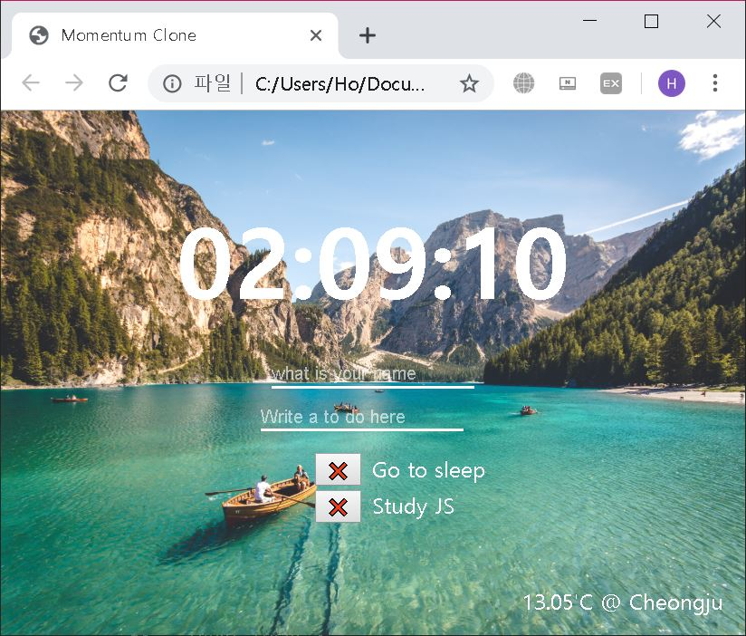
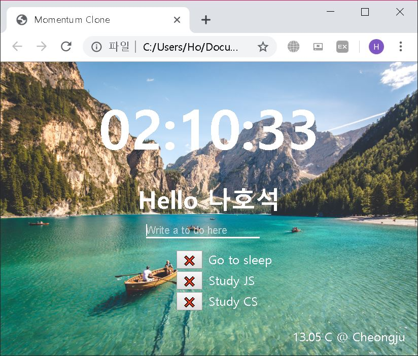

# momentumClone
> Momentum App 클론코딩.

Momentum App 클론코딩.

노마드 코더 바닐라 JS로 크롬 앱 만들기 강의로 진행. 강의 링크 : [바로가기](https://academy.nomadcoders.co/p/javascript-basics-for-absolute-beginners-kr)

JS 기초 학습을 목표로 진행.

완성페이지 : https://hoseokna.github.io/momentumClone/

## 기능
* 할 일 목록(To Do List)
* 시계(Clock)
* 현재 지역 날씨(Weather with Geolocation)
* 사용자 이름 입력

## 학습 내용
* VanillaJS 기초 (Variables, DataType, Object, function 등)
* Local Storage에 데이터 저장학고 불러오기
* Open Weather API 사용하여 계절정보 값 얻어와 사용하기

## 해야할 일
* ~~CSS 수정하여 레이아웃 및 화면 꾸미기~~ (19.10.25 완료)

## 업데이트 내역

* 0.0.1
    * 모든 기능 구현 완료
* 0.1.0
    * 유저 이름 저장 및 불러오기 오류 수정
    * css 편집 완료

## 정보

나호석 – hsna7024@gmail.com
